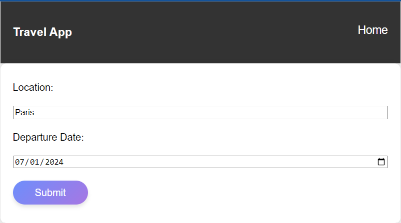
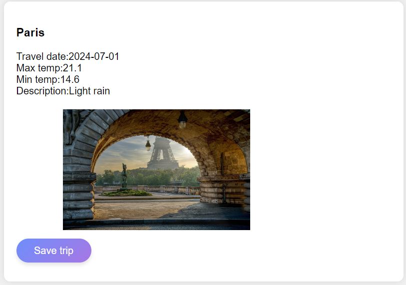
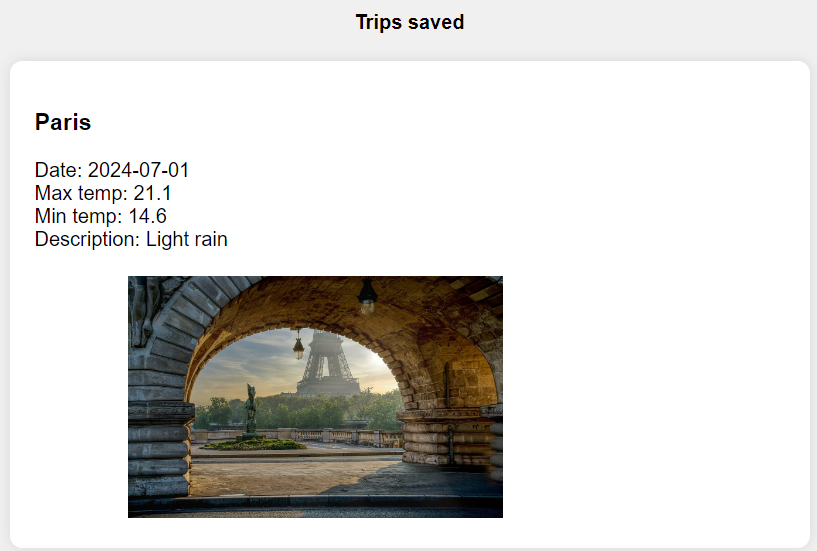

# FEND Capstone - Travel App

## Overview
This project provide photo and weather info of a place you want to travel

## Instructions
This will require modifying the `server.js` file and the `website/app.js` file. You can see `index.html` for element references, and once you are finished with the project steps, you can use `style.css` to style your application to customized perfection.

## Setting up project
1. Make sure your version of:<br>
npm: 10.2.3<br>
node: v20.10.0
2. Install node modules: 
```
npm i
```
3. Setting evn:<br>
3.1 Create `.env` file on root of project (same position to package.json)
3.2 Write content in `.env` file as below:
```
WEATHER_KEY=xxx
PIXA_KEY=xxx
GEONAME_KEY=xxx
```
with:<br>
WEATHER_KEY: key of `weatherbit.io`<br>
PIXA_KEY: key of `pixabay.com`<br>
GEONAME_KEY: username of `geonames.org`<br>
4. Run build project
```
npm run build-prod
```
5. Run test
```
npm run test
```
6. Run project
```
npm start
```
7. Open web on browser
http://localhost:3000/

## Start
1. Pic your location and date <br>

<br>
Type `Location` you want to go and pick `Departure Date`, click `Submit `

2. Display trip info<br>

<br>
When `Departure Date` is in 7 days from today, trip will display photo and weather info of your place.<br>
else `Departure Date` is greader than 7 days, only display photo<br>
You can click `Save trip` to save your trip locally.<br>

3. Save trip list<br>

<br>
Wish you have interesting travels! ^.^